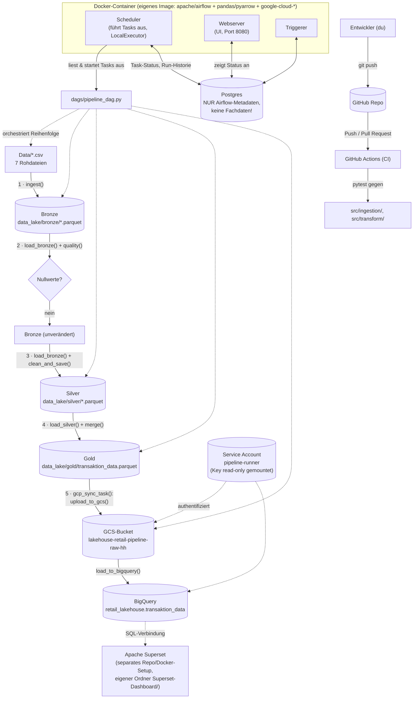

# Lakehouse Retail Pipeline

End-to-End-Datenpipeline für Fashion-Retail Sales & Inventory Analytics — Portfolio-Projekt zum Aufbau von GCP- und Airflow-Kenntnissen neben bestehender Databricks/PySpark/Power-BI-Erfahrung.

## Architektur

Bronze/Silver/Gold-Lakehouse-Muster:

- **Bronze** (`data_lake/bronze/`) — Rohdaten aus `Data/` (7 CSVs: campaigns, channels, customers, products, sales, salesitems, stock), unverändert als Parquet
- **Silver** (`data_lake/silver/`) — bereinigte Einzeltabellen (z.B. `discount_percent` als float statt String)
- **Gold** (`data_lake/gold/`) — `transaktion_data.parquet`, denormalisierte Tabelle auf Item-Ebene für Reporting

Orchestriert über Apache Airflow (lokal, Docker, `LocalExecutor`) — inkl. eines Tasks, der Gold-Daten automatisch nach GCS + BigQuery synct.

### Überblick



### Rollen der Tools

| Tool / Komponente | Rolle im Projekt | Kommuniziert mit |
|---|---|---|
| **`Data/*.csv`** | Rohdaten-Quelle, statisch, synthetischer Fashion-Retail-Datensatz | wird von `ingest()` gelesen |
| **pandas** (in `src/ingestion/`, `src/transform/`) | Führt die eigentliche Transformationslogik aus (Lesen, Bereinigen, Mergen, Schreiben) | liest/schreibt Parquet-Dateien in `data_lake/` |
| **PyArrow** | Bibliothek, die pandas zum Lesen/Schreiben von Parquet nutzt | wird von pandas intern aufgerufen |
| **`data_lake/{bronze,silver,gold}/`** | Der eigentliche "Lakehouse"-Speicher — reine Parquet-Dateien auf der Festplatte, kein Datenbank-Server | wird von Airflow-Tasks gelesen/geschrieben (per Docker-Volume in den Container gemountet) |
| **Apache Airflow (Scheduler)** | Orchestriert die Reihenfolge der 5 Tasks (`ingest → quality → clean_and_save → merge_and_save → gcp_sync`), startet sie, überwacht Erfolg/Fehler | liest `dags/pipeline_dag.py`, schreibt Status in Postgres |
| **Apache Airflow (Webserver)** | Web-UI zum Anschauen/manuellen Triggern von DAG-Runs | liest Status aus Postgres |
| **Apache Airflow (Triggerer)** | Verwaltet asynchrone/"deferred" Tasks (bei dieser einfachen DAG aktuell nicht aktiv genutzt, aber Teil des Standard-Setups) | Postgres |
| **Postgres** | **Nur** Airflows eigene Betriebsdatenbank — speichert DAG-Run-Historie, Task-Status, Verbindungen. **Enthält keine Fachdaten** (keine Sales/Customers etc.) — das ist ein häufiger Verwechslungspunkt! | Scheduler, Webserver, Triggerer |
| **Docker / docker-compose** | Verpackt Airflow + Postgres als isolierte, reproduzierbare Container; mountet `dags/`, `src/`, `Data/`, `data_lake/` in die Container hinein | Host-Dateisystem (via Volumes) |
| **Eigenes Dockerfile** | Erweitert das Standard-Airflow-Image um `pandas`/`pyarrow`, damit die Tasks im Container die Transform-Logik überhaupt ausführen können | Basis für alle 4 Airflow-Container (webserver, scheduler, triggerer, init) |
| **`.venv`** | Lokale Python-Umgebung für Entwicklung/Notebook/manuelles Testen **außerhalb** von Docker (z.B. `python pipeline.py`, `pytest`) | unabhängig von den Docker-Containern — bewusst getrennt, um Versionskonflikte zu vermeiden |
| **Pytest** | Prüft die Transform-Logik (`quality`, `clean_and_save`, `merge`) automatisiert, ohne echte Daten/Airflow zu brauchen | läuft gegen `src/`, lokal und in GitHub Actions |
| **GitHub Repo** | Zentrale Quelle der Wahrheit für den Code, Historie via Commits/Branches | Entwickler pusht hierhin, GitHub Actions reagiert darauf |
| **GitHub Actions (CI)** | Führt bei jedem Push/PR automatisch `pytest` in einer frischen Cloud-VM aus — verhindert, dass kaputter Code nach `main` gelangt | checkt Code aus GitHub aus, installiert `requirements.txt`, ruft `pytest` auf |
| **GCS-Bucket** (`lakehouse-retail-pipeline-raw-hh`) | Objektspeicher in der Cloud — nimmt Rohdaten (`raw/`) und Gold-Daten (`gold/`) als Parquet/CSV entgegen | wird von `GCPStorage.upload_to_gcs()` beschrieben, von BigQuery als Quelle gelesen |
| **BigQuery** (Dataset `retail_lakehouse`) | SQL-basiertes Data Warehouse, GCP-Pendant zu Databricks/Delta Lake — Zielort für `transaktion_data` als abfragbare Tabelle | wird von `GCPBigQuery.load_to_bigquery()` per Load-Job aus GCS befüllt |
| **Service Account `pipeline-runner`** | Technische, nicht-persönliche GCP-Identität mit den Rollen `storage.objectAdmin`, `bigquery.dataEditor`, `bigquery.jobUser` — authentifiziert Container-Code bei GCP, ganz ohne Browser-Login | Key liegt außerhalb des Repos (`~/.gcp-keys/`), read-only in den Airflow-Container gemountet |
| **Apache Superset** | Open-Source-BI-Dashboard (Power-BI-Äquivalent), Reporting-Layer über den Gold-Daten in BigQuery | eigenständiges Docker-Setup in **separatem Ordner außerhalb dieses Repos** (`../Superset-Dashboard/`), verbindet sich per SQL/SQLAlchemy mit BigQuery |

## Setup

```bash
python -m venv .venv
source .venv/bin/activate
pip install -r requirements.txt
```

## Pipeline ausführen

```bash
cd src
python pipeline.py
```

Führt Bronze → Silver → Gold sequenziell aus und schreibt die Ergebnisse nach `data_lake/`.

## Airflow (lokal, Docker)

```bash
docker-compose up airflow-init   # einmalig
docker-compose up -d
```

Web-UI: http://localhost:8080 (Login: `airflow` / `airflow`)

Voraussetzung: `.env` mit `AIRFLOW_UID` (eigene User-ID, siehe `id -u`).

## Projektstruktur

```
src/
├── ingestion/    # CSV → Bronze
├── transform/    # Bronze → Silver, Merge zu Gold
├── gcp/          # GCS-Upload + BigQuery-Load (Service Account)
└── governance/   # geplant: Unity-Catalog-artige Governance
dags/             # Airflow-DAGs
notebooks/        # explorative Analyse (EDA)
tests/            # Pytest für Transform-Logik
dashboards/       # Superset-Dashboard-Export (Dashboard, Charts, Dataset-Metadaten)
```

Das Dashboard ist mit Apache Superset gebaut (läuft lokal in Docker, separat vom Pipeline-Code) und nutzt die Gold-Daten aus `data_lake/gold/transaktion_data.parquet` über MySQL. Der Export (Dashboard-Layout, Charts, Dataset-Referenz) liegt in [`dashboards/superset_export/`](dashboards/superset_export/), siehe [dashboards/README.md](dashboards/README.md) zum Re-Import.

## Status

- [x] Bronze/Silver/Gold-Pipeline (lokal, pandas)
- [x] Airflow lokal via Docker (LocalExecutor)
- [x] Airflow-DAG für die Pipeline (5 Tasks, inkl. GCP-Sync)
- [x] Tests + CI/CD (GitHub Actions)
- [x] GCP-Integration (GCS, BigQuery) — in die DAG eingebunden
- [x] Dashboard (Apache Superset)
