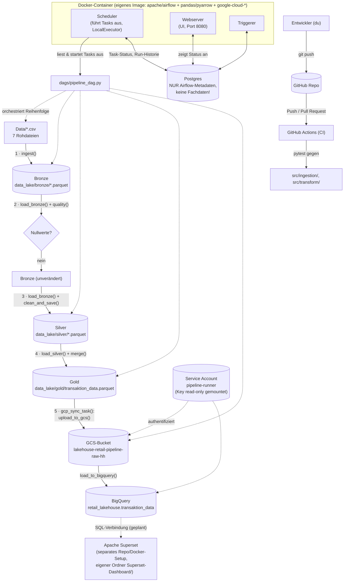
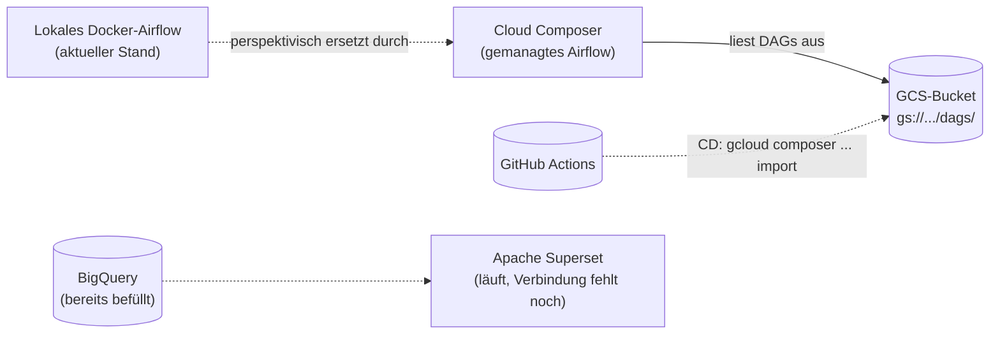

# Architektur — Lakehouse Retail Pipeline

Dieses Dokument beschreibt, welche Tools im Projekt zusammenspielen, welche Rolle jedes davon hat, und wie sie miteinander kommunizieren. Stand: lokales Airflow (Docker) orchestriert Bronze/Silver/Gold **und** synct Gold-Daten automatisiert nach GCS + BigQuery. Cloud Composer/CD sind noch geplant, siehe Abschnitt 4.

## 1. Überblick

## 2. Rollen der Tools

| Tool / Komponente | Rolle im Projekt | Kommuniziert mit |
|---|---|---|
| **`Data/*.csv`** | Rohdaten-Quelle, statisch, synthetischer Fashion-Retail-Datensatz | wird von `ingest()` gelesen |
| **pandas** (in `src/ingestion/`, `src/transform/`) | Führt die eigentliche Transformationslogik aus (Lesen, Bereinigen, Mergen, Schreiben) | liest/schreibt Parquet-Dateien in `data_lake/` |
| **PyArrow** | Bibliothek, die pandas zum Lesen/Schreiben von Parquet nutzt | wird von pandas intern aufgerufen |
| **`data_lake/{bronze,silver,gold}/`** | Der eigentliche "Lakehouse"-Speicher — reine Parquet-Dateien auf der Festplatte, kein Datenbank-Server | wird von Airflow-Tasks gelesen/geschrieben (per Docker-Volume in den Container gemountet) |
| **Apache Airflow (Scheduler)** | Orchestriert die Reihenfolge der 5 Tasks (`ingest → quality → clean_and_save → merge_and_save → gcp_sync`), startet sie, überwacht Erfolg/Fehler | liest `dags/pipeline_dag.py`, schreibt Status in Postgres |
| **Apache Airflow (Webserver)** | Web-UI zum Anschauen/manuellen Triggern von DAG-Runs | liest Status aus Postgres |
| **Apache Airflow (Triggerer)** | Verwaltet asynchrone/"deferred" Tasks (bei dieser einfachen DAG aktuell nicht aktiv genutzt, aber Teil des Standard-Setups) | Postgres |
| **Postgres** | **Nur** Airflows eigene Betriebsdatenbank — speichert DAG-Run-Historie, Task-Status, Verbindungen. **Enthält keine Fachdaten** (keine Sales/Customers etc.) — das ist ein häufiger Verwechslungspunkt! | Scheduler, Webserver, Triggerer |
| **Docker / docker-compose** | Verpackt Airflow + Postgres als isolierte, reproduzierbare Container; mountet `dags/`, `src/`, `Data/`, `data_lake/` in die Container hinein | Host-Dateisystem (via Volumes) |
| **Eigenes Dockerfile** | Erweitert das Standard-Airflow-Image um `pandas`/`pyarrow`, damit die Tasks im Container die Transform-Logik überhaupt ausführen können | Basis für alle 4 Airflow-Container (webserver, scheduler, triggerer, init) |
| **`.venv`** | Lokale Python-Umgebung für Entwicklung/Notebook/manuelles Testen **außerhalb** von Docker (z.B. `python pipeline.py`, `pytest`) | unabhängig von den Docker-Containern — bewusst getrennt, um Versionskonflikte zu vermeiden |
| **Pytest** | Prüft die Transform-Logik (`quality`, `clean_and_save`, `merge`) automatisiert, ohne echte Daten/Airflow zu brauchen | läuft gegen `src/`, lokal und in GitHub Actions |
| **GitHub Repo** | Zentrale Quelle der Wahrheit für den Code, Historie via Commits/Branches | Entwickler pusht hierhin, GitHub Actions reagiert darauf |
| **GitHub Actions (CI)** | Führt bei jedem Push/PR automatisch `pytest` in einer frischen Cloud-VM aus — verhindert, dass kaputter Code nach `main` gelangt | checkt Code aus GitHub aus, installiert `requirements.txt`, ruft `pytest` auf |
| **GCS-Bucket** (`lakehouse-retail-pipeline-raw-hh`) | Objektspeicher in der Cloud — nimmt Rohdaten (`raw/`) und Gold-Daten (`gold/`) als Parquet/CSV entgegen | wird von `GCPStorage.upload_to_gcs()` beschrieben, von BigQuery als Quelle gelesen |
| **BigQuery** (Dataset `retail_lakehouse`) | SQL-basiertes Data Warehouse, GCP-Pendant zu Databricks/Delta Lake — Zielort für `transaktion_data` als abfragbare Tabelle | wird von `GCPBigQuery.load_to_bigquery()` per Load-Job aus GCS befüllt |
| **Service Account `pipeline-runner`** | Technische, nicht-persönliche GCP-Identität mit den Rollen `storage.objectAdmin`, `bigquery.dataEditor`, `bigquery.jobUser` — authentifiziert Container-Code bei GCP, ganz ohne Browser-Login | Key liegt außerhalb des Repos (`~/.gcp-keys/`), read-only in den Airflow-Container gemountet |
| **Apache Superset** | Open-Source-BI-Dashboard (Power-BI-Äquivalent), Reporting-Layer über den Gold-Daten in BigQuery | eigenständiges Docker-Setup in **separatem Ordner außerhalb dieses Repos** (`../Superset-Dashboard/`), da es kein eigener Projekt-Code ist, sondern ein extern bezogenes Tool — verbindet sich per SQL/SQLAlchemy mit BigQuery |

## 3. Der Datenfluss im Detail (die 5 Airflow-Tasks)

1. **`ingest_task`** — liest die 7 CSVs aus `Data/`, schreibt sie unverändert als Parquet nach `data_lake/bronze/`
2. **`quality_task`** — liest Bronze erneut ein (`load_bronze()`), prüft auf Nullwerte, bricht bei Problemen mit `ValueError` ab
3. **`clean_and_save_task`** — liest Bronze erneut ein, bereinigt `discount_percent` (String → Float), schreibt nach `data_lake/silver/`
4. **`merge_and_save_task`** — liest Silver ein (`load_silver()`), führt alle Tabellen zu `transaktion_data` zusammen (Item-Ebene), speichert als Gold in `data_lake/gold/`
5. **`gcp_sync_task`** — lädt die Gold-Parquet-Datei nach GCS hoch, dann von GCS per Load-Job nach BigQuery (Tabelle `retail_lakehouse.transaktion_data`)

**Wichtig zum Verständnis:** Jede Task liest ihre Eingabedaten selbst neu von der Festplatte — es werden **keine DataFrames zwischen Tasks über Airflow selbst transportiert** (kein XCom für große Daten). Das ist bewusst so gebaut, weil Airflow-Tasks isolierte Prozesse sind und XCom nur für kleine Metadaten gedacht ist, nicht für komplette pandas-DataFrames.

## 4. Erledigt vs. noch geplant

**Bereits gebaut** (siehe Diagramm oben): GCS-Bucket, BigQuery-Dataset, Service-Account-Auth, `gcp_sync_task` in der DAG — die Gold-Daten landen bei jedem DAG-Run automatisch auch in BigQuery. Apache Superset läuft (separates Docker-Setup in `../Superset-Dashboard/`), die BigQuery-Verbindung/das eigentliche Dashboard darin ist der nächste Schritt.

**Noch offen:**

- **Cloud Composer** — GCP-gehostetes Airflow; würde das lokale Docker-Setup für eine "echte" Cloud-Umgebung ablösen. Bewusst noch nicht umgesetzt — verursacht laufende Kosten (siehe Kostenabschnitt aus dem Chat), daher eher kurz für eine Demo geplant als dauerhaft betrieben
- **CD via GitHub Actions** — nach erfolgreichem CI-Lauf automatisch die DAG-Datei in den Composer-GCS-Bucket kopieren (`gcloud composer environments storage dags import`) — ergibt erst Sinn, sobald Composer existiert
- **Superset ↔ BigQuery-Verbindung + eigentliches Dashboard** — Superset-Container laufen bereits, die Datenquelle muss noch eingerichtet und ein Dashboard darauf gebaut werden
- **`src/governance/`** — leerer Stub für Unity-Catalog-artige Governance, niedrigste Priorität
